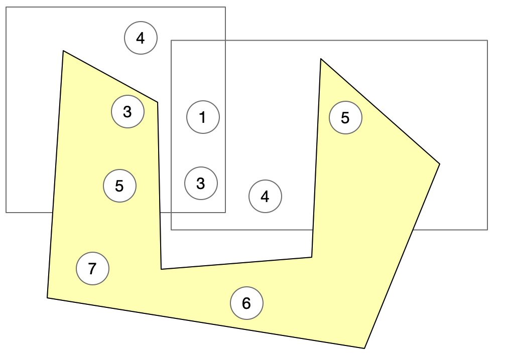

# BDWare-Scheduling

## 来源

@王旭 & @BDWare

## 使用

```shell
python setup.py bdist_wheel
pip install -U dist/scheduling_tool*
```

## 需求描述

1. 来了一个部署合约的请求，需要一个策略去给出部署该合约的集群（场景：合约超过十天没人调用，就会自动持久化到账本。此时一个请求来了，那么需要从账本上把这个合约状态恢复）
   - CenterPortal（NC）收到请求后，将其管理的所有集群的信息（节点URL、storage、traffic），资源阈值 threshold，以及需要部署的合约所需资源（storage与traffic）作为输入，调用Scheduler的query_deployed_cluster 接口
   - Scheduler接收请求后，根据节点URL对各个节点上部署的合约信息进行查询（合约storage与traffic），给出需要部署的合约应该在哪个集群
   - CenterPortal根据返回结果进行合约的部署
2. 迁移合约（随着合约越增加越多，某个节点的内存/硬盘/CPU可能存在80%以上的情况）
   - CenterPortal（NC）将其管理的所有集群的信息（节点URL、storage、traffic）以及资源阈值 threshold，定期调用Scheduler的 query_lb_by_nodes 接口
   - Scheduler接收请求后，根据节点URL对各个节点上部署的合约信息进行查询（合约storage与traffic），给出各个合约分别应该在哪个集群
   - CenterPortal根据返回结果进行合约的迁移

注：目前只能通过节点URL查询合约信息，且合约信息只包含了storage与traffic

## 思路

需求2 可以被抽象如下：

有若干集合，每个集合中有若干点，每个点有一定的初始值 ，每个点可以属于多个集合。

已经进行 n 次如下操作：

- 选择某个集合，该集合中所有点加一个数x_i（对每个集群操作次数不超过100）。

现在可以进行的操作：

- 将一个集合中的所有点减一个数（这个数在  内），并让另一个集合中所有点加这个数。

现在设定了一个阈值 h ，要使得每个点都不大于初始值 

问最少需要做多少次操作，每次操作是什么？



目前是暴力贪心实现，还没有什么思路。

